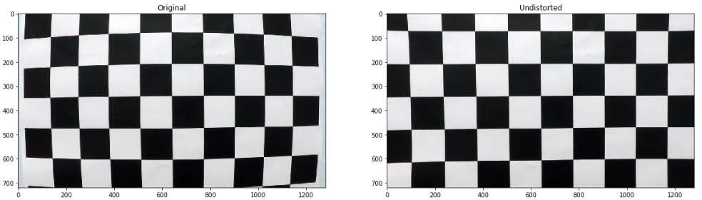
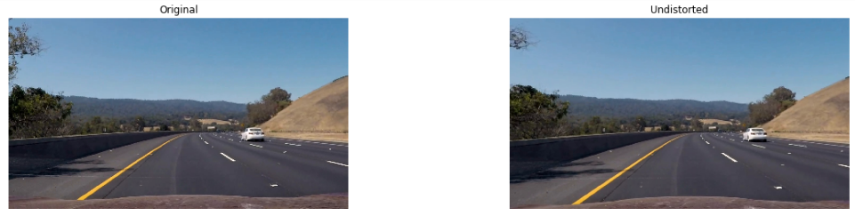
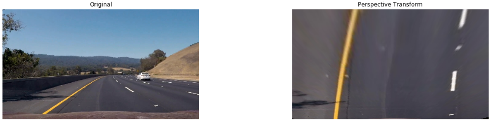
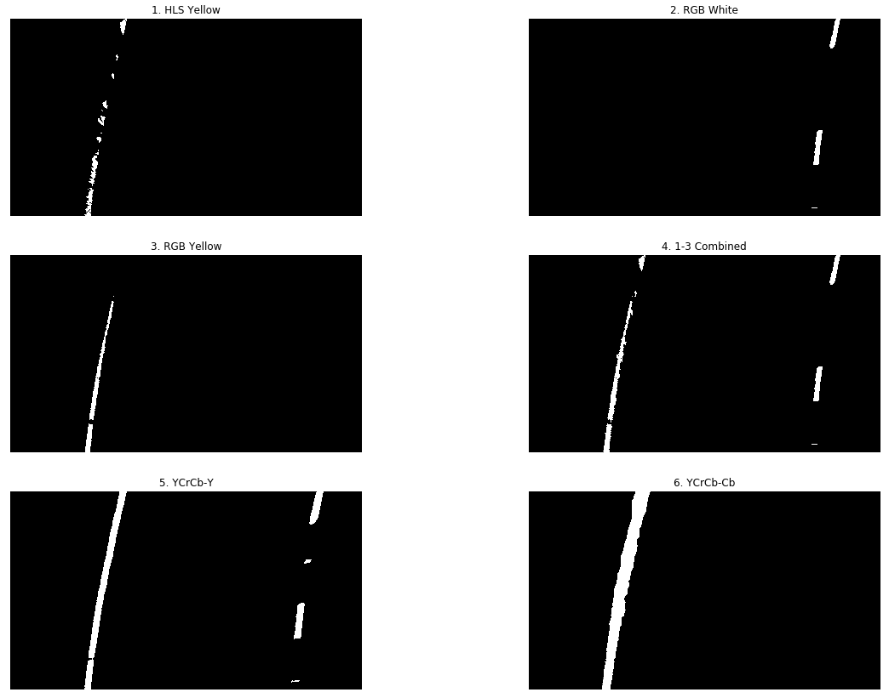
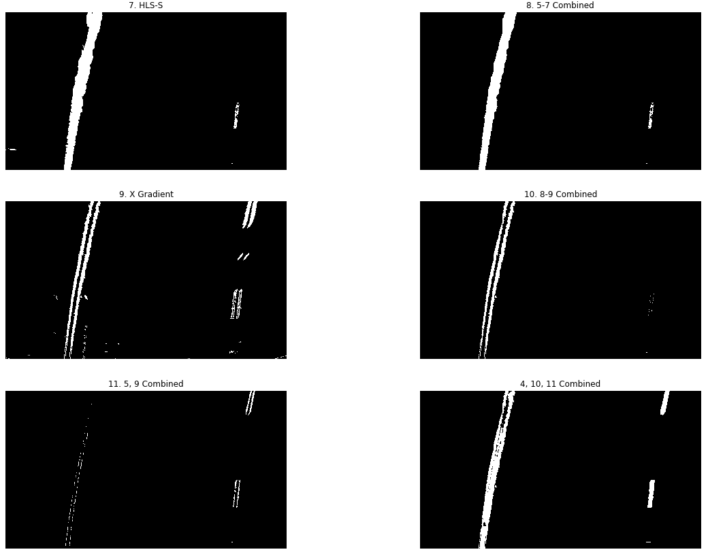
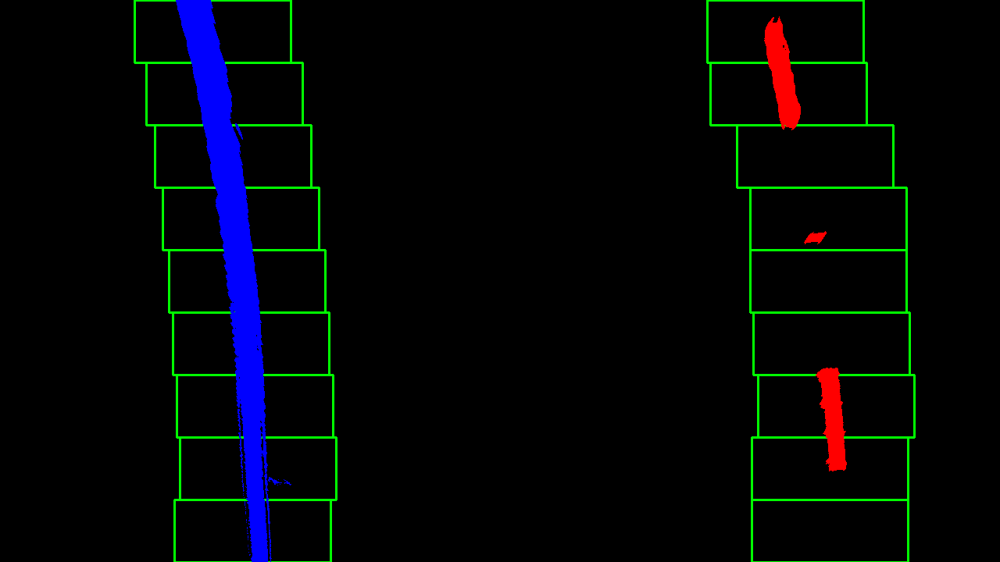
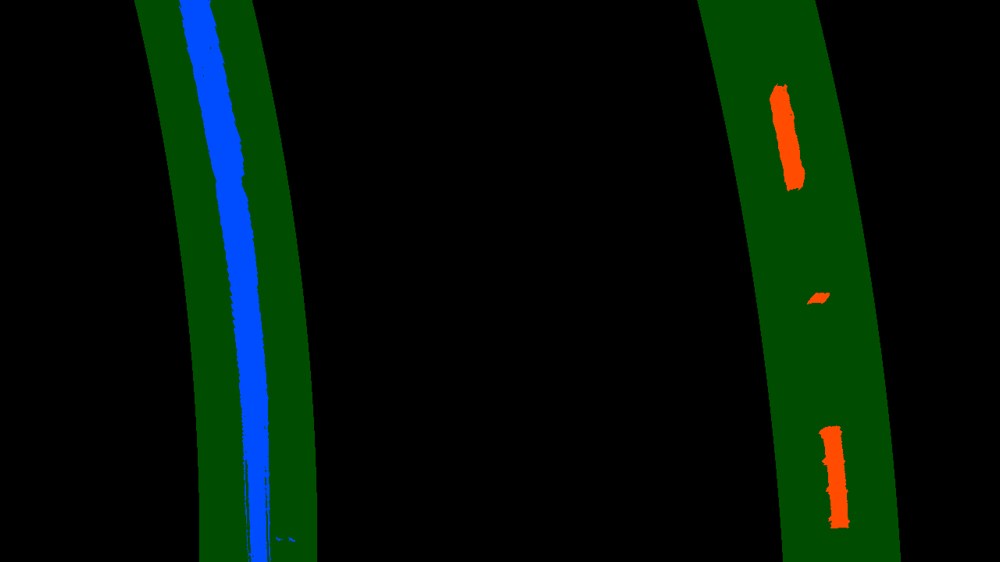
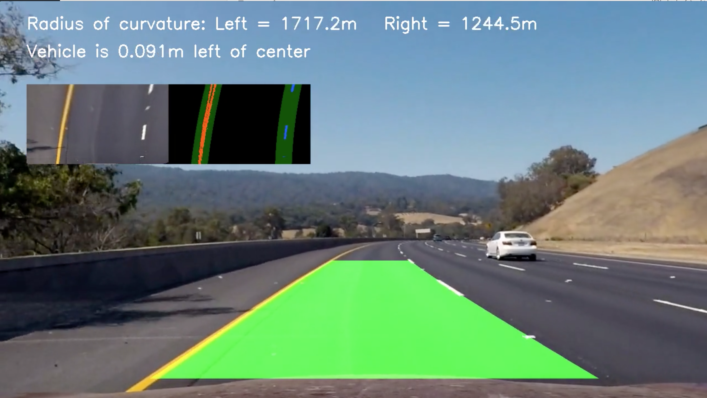

## Advanced Lane Finding

## Overview

Software pipeline to identify lane lines and measure lane curvature from a video taken from a front-facing camera on a car. The high-level steps are as follows:
* Calibrate camera to remove distortion
* Apply thresholds on color and gradient features to isloate pixels of lane lines
* Apply perspective transform on region of interest 
* Classify left/right lane line pixels by searching image with sliding windows, or using the location of previously detected lane lines
* Generate lane line polynomial fit on the pixels detected from the previous step
* Warp the the polynomial fit back onto the original image 

### Calibrate Camera
Use OpenCV functions findChessboardCorners, drawChessboardCorners, calibrateCamera and chessboard images to compute calibration and distortion matrix to undistort each frame of video. Save the output to a pickle file for later use in the pipeline

 

## Pipeline

### 1. Distortion Correction
Use the OpenCV function undistort() and the pickled camera matrix and distortion coefficents to undistort the frame

### 2. Perspective Transform

Use trapezoidal region of interest and OpenCV function getPerspectiveTransform to get transform matrix and inverse matrix.

### 3. Apply Color and Gradient Thresholds

I manually tuned these color and gradient thresholds to be robust to lane color and varied lighting conditions. There are several combinations of thresholds that are detailed below. The last image (bottom right) is the final binary image passed to the next step in the pipeline. 

 

### 4 Lane Line Detection 
There are 2 ways in which this pipeline categorizes the pixels from the binary image as "left lane pixels", "right lane pixels", or falsely identified. The "New Fit" process, detailed in section 4.1, occurs when the condition below fails. "Historical Fit", detailed in section 4.2 occurs when the condition is true.
* Detection condition: 3 frames that have identified lane lines with "high confidence", and there haven't been 3 consecutive frames without a high confidence detection 
* high confidence = a lane line detected when the 2 lines (left and right) have radius of curvature < 300 meters, and the distance between the detected lane lines is >=400px and <=900px. 

### 4.1 Lane line Detection - New Fit 
This technique is "starting from scratch". This occurs either at the beginning of the video, or when the pipeline has not made a high confidence detection due to difficult road conditions. To start, a histogram of the bottom half of the binary threshold image determines the X position of the left and right lane lines. These two positions are where the sliding window technique begins. After tuning, I discovered that 9 windows, 100 pixel window width, and 50 pixel minimum to shift window, gives good performance. Pixels identified in each window are considered lane line pixels. Using these detected pixels, a lane line polynomial fit is calculated and saved for use in future frames.

### 4.2 Lane Line Detection - Historical Fit
This approach is used to detect lane line pixels if the "high confidence" condition, stated above, is passed. In this case, instead of a sliding window, the previous 3 high confidence polynomial fits are averaged. This average polynomial becomes the region of interest (+/- 75 pixels horizontally) for detecting lane line pixels in this frame. 

### 5. Calculate Curvature
Calculate radii of curvature for both left and right lane lines

### 6. Determine Detection Confidence and Save
Issue a lane line acceptance test to determine if this detection is considered "high confidence". The following two conditions must be met:
* If 1 lane has significant curvature (>300 meters), then the two lanes must not differ in curvature by more than 300 meters
* The starting position of the left and right lines must be >=400px and <=900px apart
If these conditions are met, the lane detection gets saved to the Lane_Detector class to be used in finding lane pixels in future frames

### 7. Final Image
Warp the fit from the rectified image back onto the original image. Add picture in picture video for visualization of raw detections

## Dependencies

* Python 3
* OpenCV
* Numpy
* matplotlib
* Jupyter Notebook

Note: Udacity has a handy Anaconda environment that includes many of the dependencies used in the Self-Driving Car Nanodegree: [CarND Term1 Starter Kit](https://github.com/udacity/CarND-Term1-Starter-Kit/blob/master/README.md)

## Running the code 
The project is completed in a Jupyter notebook. 
To start Jupyter in your browser, run the following command at the terminal prompt and within your Python 3 environment:

`> jupyter notebook`
